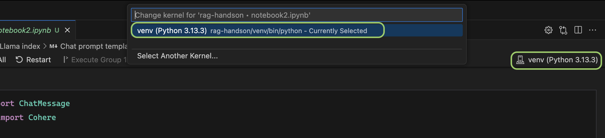

# RAG Handson
This project demonstrates how to use [LlamaIndex](https://github.com/jerryjliu/llama_index) to build Retrieval-Augmented Generation (RAG) applications powered by Large Language Models (LLMs). It provides hands-on notebooks that walk through setting up a RAG pipeline, integrating external data sources, and leveraging LLMs for enhanced question answering and information retrieval.

## Running this Project

To run the notebooks in this project, follow these steps:

1. **Clone the Repository**
    ```bash
    git clone git@github.com:atulGupta2922/rag-handson.git
    ```
    ```bash
    cd rag-handson
    ```

2. **Set Up a Python Environment**
    - Create and activate a virtual environment:
      ```bash
      python3 -m venv venv
      source venv/bin/activate
      ```
    - Install dependencies:
      ```bash
      pip install -r requirements.txt
      ```
    - Update .env with API keys and endpoints:
      - This demo uses Cohere, openai and Azure AI Search, signup and create API keys.
      - Copy `.env-example` and rename it to `.env`, update the following keys:
      ```
        CO_API_KEY=
        OPENAI_API_KEY=
        AZURE_AI_SEARCH_ENDPOINT=
        AZURE_AI_SEARCH_API_KEY=
        AZURE_OPENAI_ENDPOINT=
        AZURE_API_KEY=
      ```

3. **Select the python kernel as shown in the image below**
    

4. **Run the Notebook Cells**
    - Open and execute each notebook in order for the desired results.
